## ⚽ PremierNexus

---

## 📋 Proje Hakkında

**PremierNexus**, İngiltere Premier League odaklı bir futbol veri ve yönetim sistemidir. Backend tarafı ASP.NET Core 8 Web API ile, katmanlı (N-Tier) mimari kullanılarak geliştirilmiştir. Veri erişimi Entity Framework Core ile sağlanırken, veriler SQL Server üzerinde tutulur. Bu yapı sayesinde proje sürdürülebilir ve kolay genişletilebilir bir hale getirilmiştir.

Uygulama; ligler, sezonlar, takımlar, stadyumlar, maçlar ve maç istatistikleri gibi temel futbol verilerini yönetir ve bu verilere REST API üzerinden erişim sağlar. Frontend tarafında ise **React (Vite)** kullanılarak modern bir SPA (Single Page Application) geliştirilmiş ve API ile entegre edilmiştir.

Puan durumu hesaplamaları, SQL Server üzerinde tanımlı **stored procedure’ler** aracılığıyla merkezi ve tutarlı bir şekilde yapılır. Böylece maç sonuçlarına göre puan tablosu dinamik olarak oluşturulur ve API üzerinden sunulur.

Teknik olarak projede AutoMapper, Generic Repository pattern, özel veri erişim katmanları ve Swagger dokümantasyonu kullanılmıştır.

Özetle, **PremierNexus**; futbol verilerini yönetmek, fikstür ve puan durumunu dinamik şekilde sunmak için geliştirilmiş, **React** tabanlı bir frontend ile **ASP.NET Core Web API** backend’ini bir araya getiren modern bir full-stack uygulamadır ve gerçek dünya benzeri akışları uygulamak amacıyla eğitim projesi kapsamında geliştirilmiştir.

---

## 🛠️ Kullanılan Teknolojiler

### 🔧 Backend (Web API)
- ASP.NET Core 8 Web API · Swagger · AutoMapper 
- Microsoft SQL Server — veri saklama; puan durumu için stored procedure (sp_GetCurrentStandingsByLeagueId)

### 🎨 Frontend (Web UI)
- React
- Vite
- React Router
- JavaScript (ES modules) — fetch ile REST API tüketimi
- CSS

### 🧩 Veri Yönetimi
- DTO katmanı
- Repository Design Pattern

### 🗄️ Veritabanı
- SQL Server
- Stored procedure ile puan tablosu ve istatistik özeti 

## 🏗️ Mimari
N-Tier mimaride bağımlılıklar genelde alttan üste doğru akar: Entity katmanı domain varlıklarını tanımlar; Data Access katmanı bu varlıklar üzerinden veritabanı erişimini (EF Core, repository vb.) üstlenir; Business katmanı iş kurallarını ve servis mantığını barındırır; DTO katmanı ise katmanlar ve API arasında taşınan veri sözleşmelerini sunar. Web API sunucu tarafındaki REST uçlarını oluşturur; Frontends ise bu API’yi tüketen istemci (React + Vite) sunumunu oluşturur.

| Katman | Proje | Açıklama |
|--------|-------|----------|
| **Entity** | PremierNexus.EntityLayer | Entities: League, Season, Stadium, Team, Match, MatchEvent, MatchStatistics |
| **Data Access** | PremierNexus.DataAccess | EF Core PremierNexusContext, Generic repository (IGenericDal) ve Ef DAL sınıfları |
| **Business** | PremierNexus.Business | Servis arayüzleri ve Manager sınıfları, AutoMapper (MappingProfile); puan durumu için StandingManager ile SQL Server stored procedure çağrıları |
| **DTO** | PremierNexus.DTOs | Veri transfer nesneleri (DTO) |
| **Presentation** | PremierNexus.WebAPI| REST API (Swagger) |
| **Frontends** | React | Vite |

---

## 🖼️ Ekran Görüntüleri

### 🏠 Kullanıcı Arayüzü

  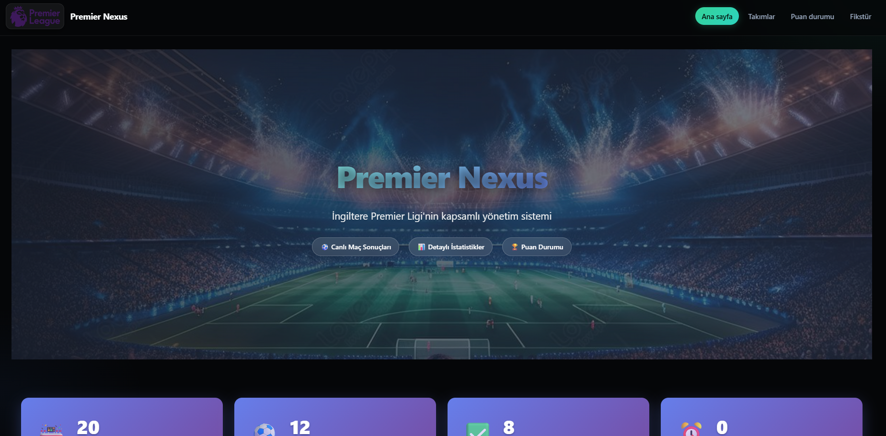
  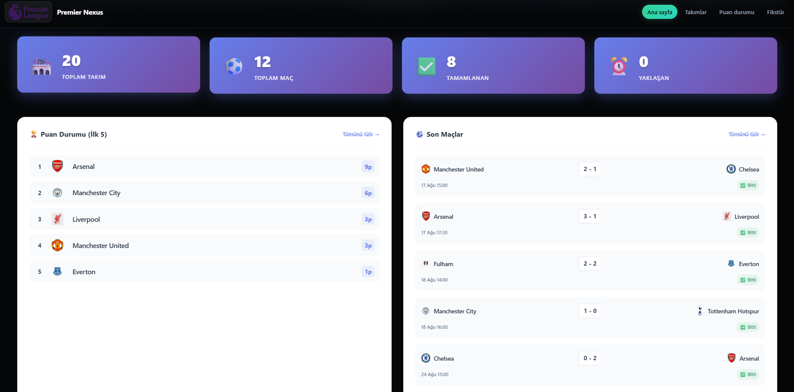
  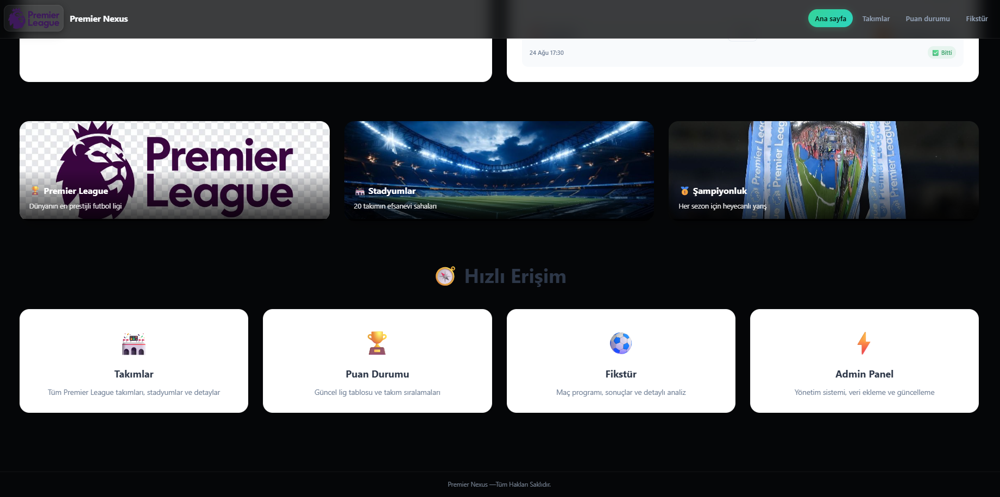
  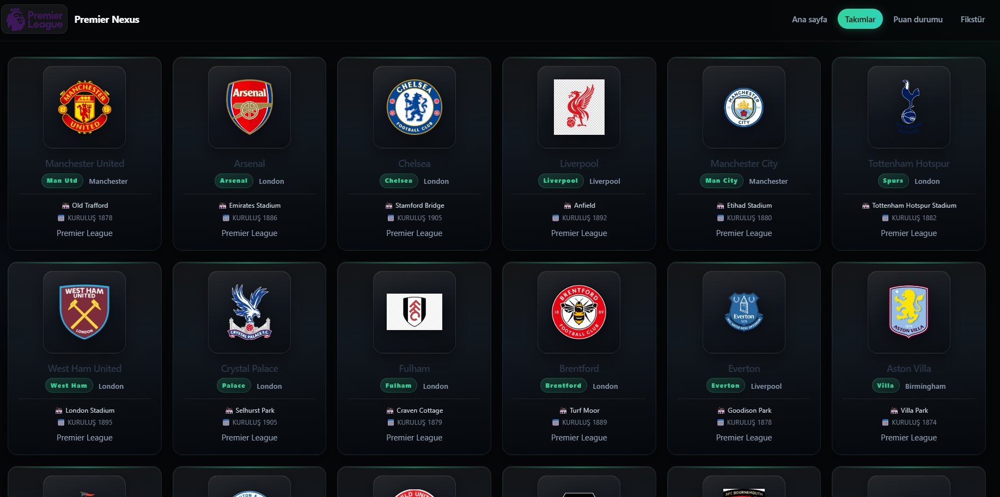
  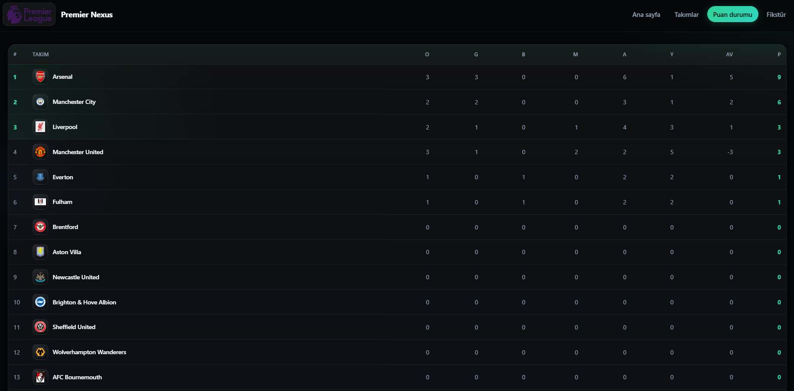
  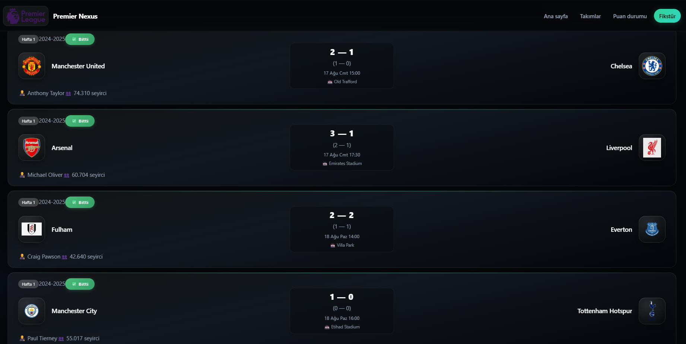
  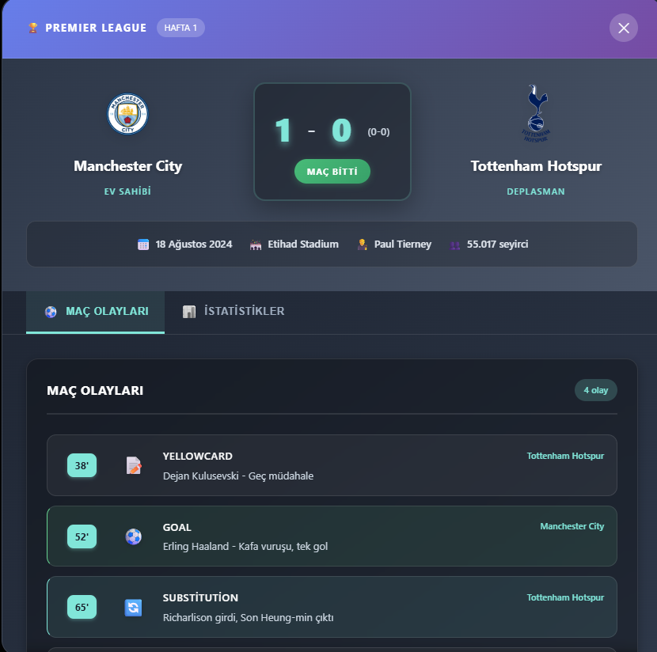
  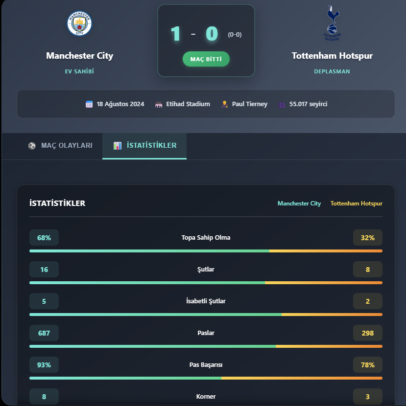

### 🔐 Admin Paneli

  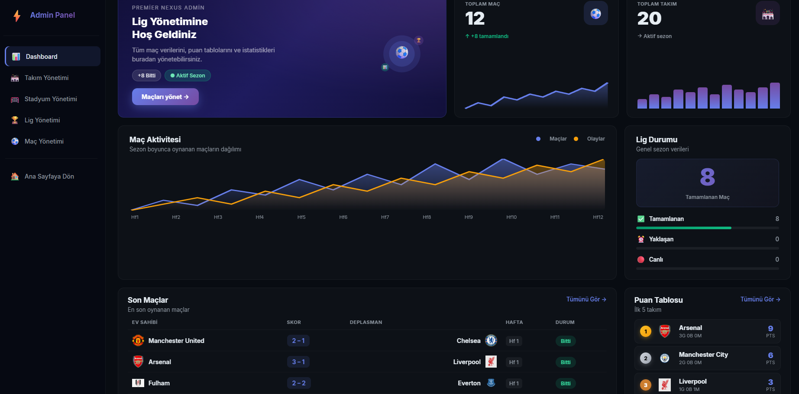
  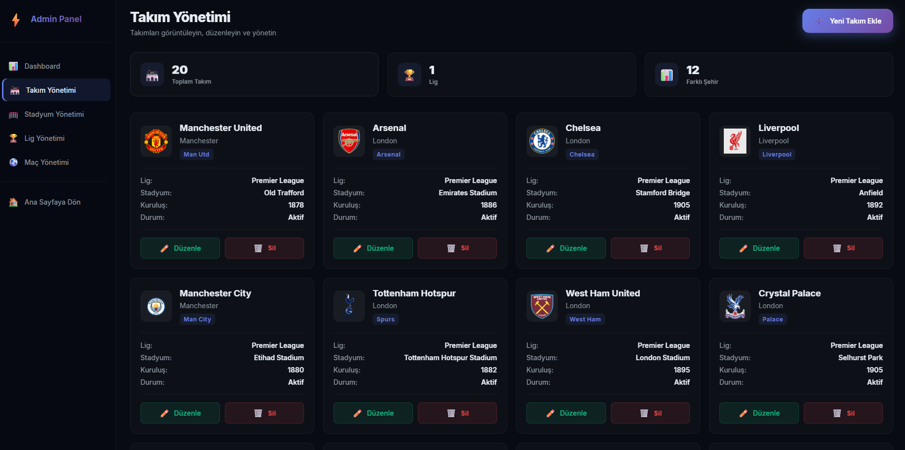
  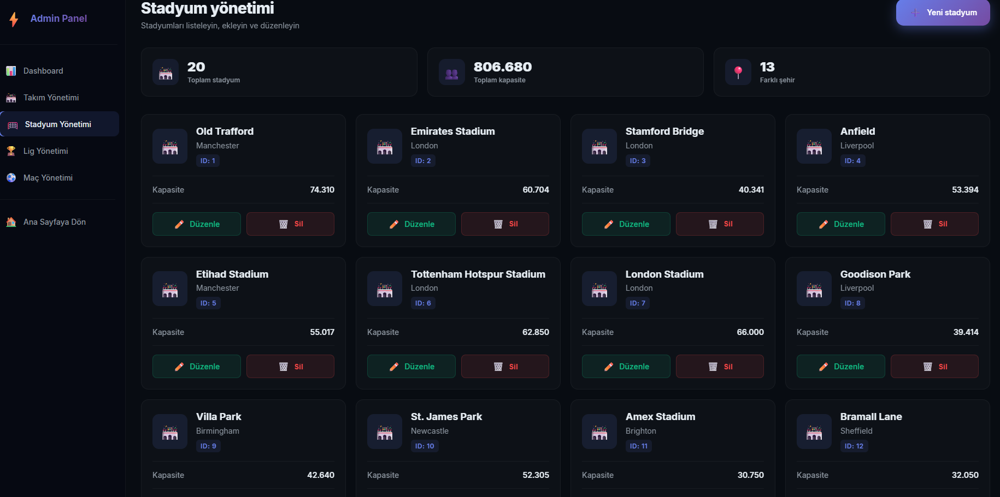
  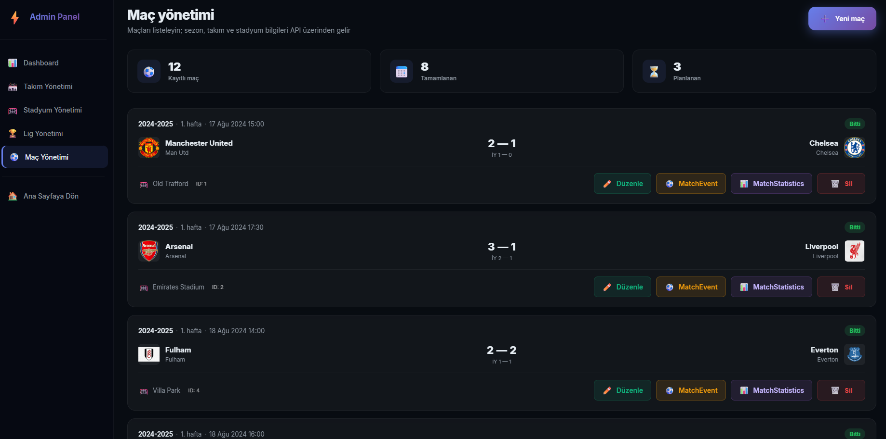

### ⚙️ Stored Procedure

  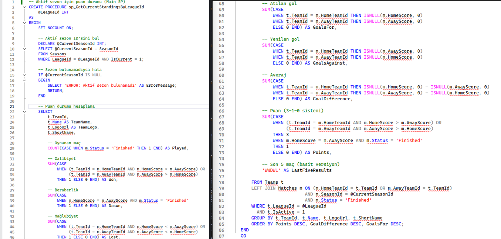

### 🗄️ Database Diyagram

  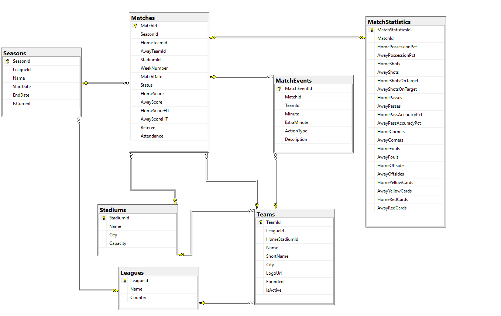

